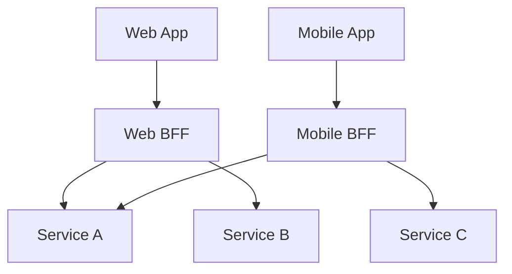

# API Gateway

## Overview

An API Gateway acts as a single entry point for a group of microservices. It handles cross-cutting concerns and routes requests to the appropriate backend services.

## Core Responsibilities

1.  **Routing**: Forwarding requests to the correct service (e.g., `/api/users` -> User Service).
2.  **Authentication & Authorization**: Verifying identity and permissions at the edge.
3.  **Rate Limiting**: Protecting services from abuse.
4.  **Protocol Translation**: Converting public HTTP/REST to internal gRPC or AMQP.
5.  **Response Aggregation**: Combining data from multiple services into a single response.

## Patterns

### Backend for Frontend (BFF)

Create separate gateways for different client types (Mobile, Web, 3rd Party) to optimize the API for each consumer.

## Implementation

### Cross-Cutting Concerns

Handle these at the gateway to keep microservices focused on business logic:

- **SSL Termination**: Decrypt HTTPS at the gateway.
- **CORS**: Handle Cross-Origin Resource Sharing headers.
- **Request Validation**: Basic schema validation before hitting services.
- **Caching**: Cache common responses.

### When to Use

| Use API Gateway When... | Avoid API Gateway When... |
|-------------------------|---------------------------|
| You have multiple microservices | You have a monolithic application |
| You need centralized auth/security | You need ultra-low latency (extra hop) |
| You have diverse clients (Web, Mobile) | Your architecture is very simple |

## Best Practices

- **Keep it Logic-Free**: Don't put business logic in the gateway. It should be a router, not a processor.
- **High Availability**: The gateway is a single point of failure; deploy it in a cluster.
- **Observability**: Ensure the gateway generates trace IDs and logs all traffic.
